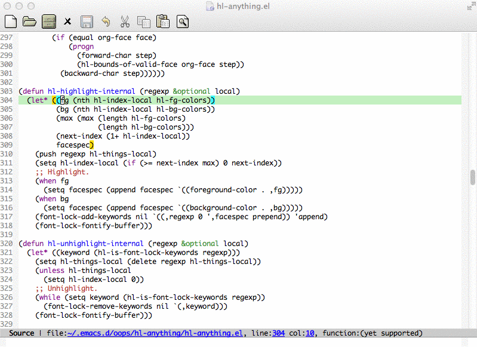
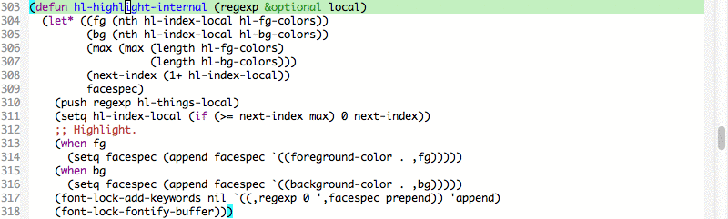
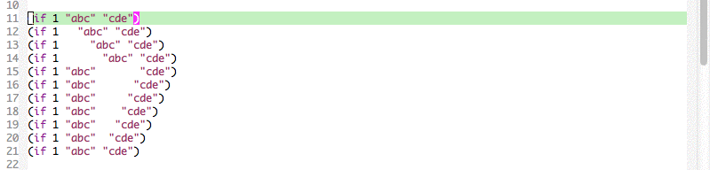
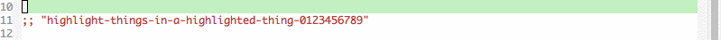
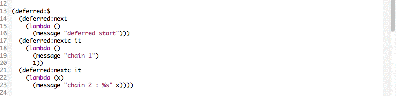

============================================
hl-anything.el - Highlight Anything in Emacs
============================================



What is it?
-----------
Things highlight in a text file is fundamental and very helpful to everyone.

Symbols highlights with different colors. Note: The highlights are still visible even under current line highlight (`hl-line-mode` or `global-hl-line-mode`).


---
Selections highlights with different colors. Note: The selections can span cross spaces or line break.


---
Highlight things in a highlighted thing.


---
Highlight enclosing inward and outward parentheses.


---
Smartly select highlighted things and search forwardly or backwardly.


---
Specify faces to be visible under current line highlight.


Usage
-----
Add the following code to your `.emacs` file:
```cl
(require 'hl-anything)
```

Interactive Functions:
* Toggle highlighting things at point: `M-x hl-highlight-thingatpt-local`
* Remove all highlights: `M-x hl-unhighlight-all-local`
* Search highlights: `M-x hl-find-thing-forwardly` or `M-x hl-find-thing-backwardly`
* Enable parenethese highlighting: `M-x hl-paren-mode`

TODO
----
* Support global highlights (which is highlights will appears in every buffers).
* Save highlights before Emacs closed and restore them after Emacs opened next time.

Lincense
--------
MIT
