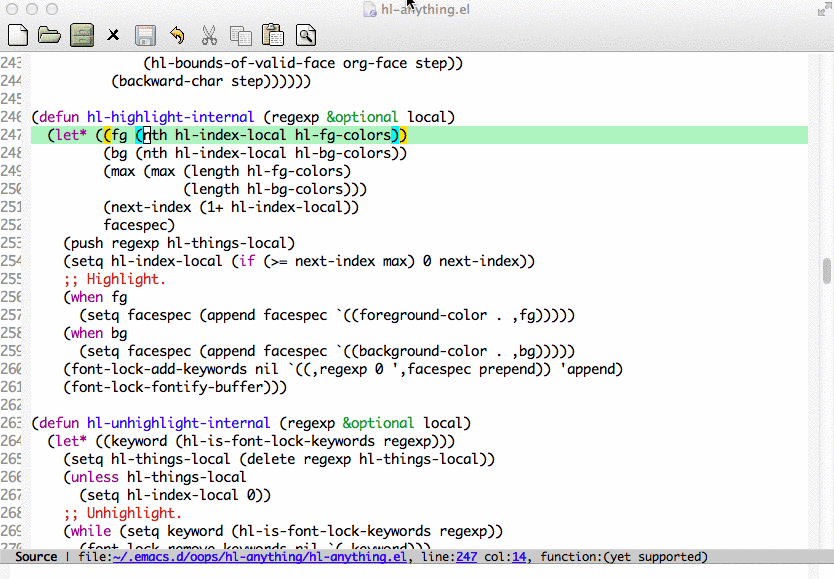

============================================
hl-anything.el - Highlight Anything in Emacs
============================================



What is it?
-----------
Things highlight in a text file is fundamental and very helpful to everyone.

- Words or selections highlights with different colors set. The highlights are still visible even under current line highlight (`hl-line-mode` or `global-hl-line-mode`).
- Search highlighted things at point in the current buffer.
- Highlight outward and inward parentheses with different colors set.
- Additional faces set for temporary highlights.

Usage
-----
Add the following code to your `.emacs` file:
```cl
(require 'hl-anything)
```

Interactive Functions:
* Toggle highlighting things at point: `M-x hl-highlight-thingatpt-local`
* Remove all highlights: `M-x hl-unhighlight-all-local`
* Search highlights: `M-x hl-find-thing-forwardly` or `M-x hl-find-thing-backwardly`
* Enable parenethese highlighting: `M-x hl-paren-mode`

Lincense
--------
MIT
